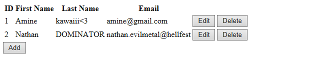
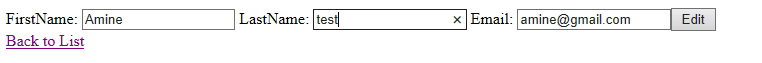
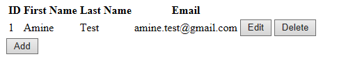

---
title:
- Report - WebStudentBook JSF JPA
subtitle:
- JavaEE & frameworks
author:
- Amine Miliani
- Nathan Immacolato
date:
- 2018.11.25
fontfamily:
- helvet
---

****
# Introduction
The goal of this project was to redo the last one with a different strategy, using JSF first, and JPA.

****
# What was done
The project is composed of a few different faces, so we will go through each one.

We  started the project by the previous JSP proejct, then transformed it into a JSF project.
We made the JSF one work with the DBUtils class, to talk with the database, then transformed the DBUtils to fit a use in JPA.
We did this to prevent working on everything at the same time and be able to advance with small understandable steps.

## List Students
In this page we display a list of the students, gathered from the database.
This page provides an *Add* button as well as an *Edit* and *Delete* button for each student.

*The list of Students*

## Edit Student
From the page that lists students, we can press a button to edit each student.
This directs the user to the **Edit Student page**, where the information for the current student are displayed.
These information can be changed, and those changes committed to the database when the button *Edit* is pressed.
The user is then redirected to the **List of Students**.

*Editing a student*

*The student edited*

## Add Student
From the page that lists students, we can press a button to add a student.
This directs the user to the **Add Student** page, where there are blank spaces for the user to write in the information for the new student.
When the user clicks on the *Add* button, the information is committed to create a new student and add it to the database.
The user is then redirected to the **List of Students**.

*Adding a student*

****
# Issues Faced
Working on the project, we faced a few issues

## Redirection and navigation
When we tried navigating the user around our faces, it didn't work, the pages wouldn't load.
After some research, we found out about the navigation rules, so we added them in the `faces-config.xml` file, and everything worked out fine from there.

## Enforcing a mail pattern
Something we ended up not having in our finished project was enforcing a mail pattern.
We tried various ideas for solutions, as using some regex we found on the internet, to creating our own with strings, but it didn't quite work.
At that point we had decided to move on to the rest of the project and come back later, as we had other issues that we solved that ranked higher in our priorities.

## Difficulties making Eclipse and Tomcat cooperate
We had a lot of trouble getting Eclipse and Tomcat to connect, behave as we wanted.
Our whole system was behaving differently even though we were apparently doing the same things, we started from scratch on both sides to try and get the least amount of differences possible, but we had errors on both sides, and not the same ones.
In the end we managed to get the systems working, after a lot of trial and error.
